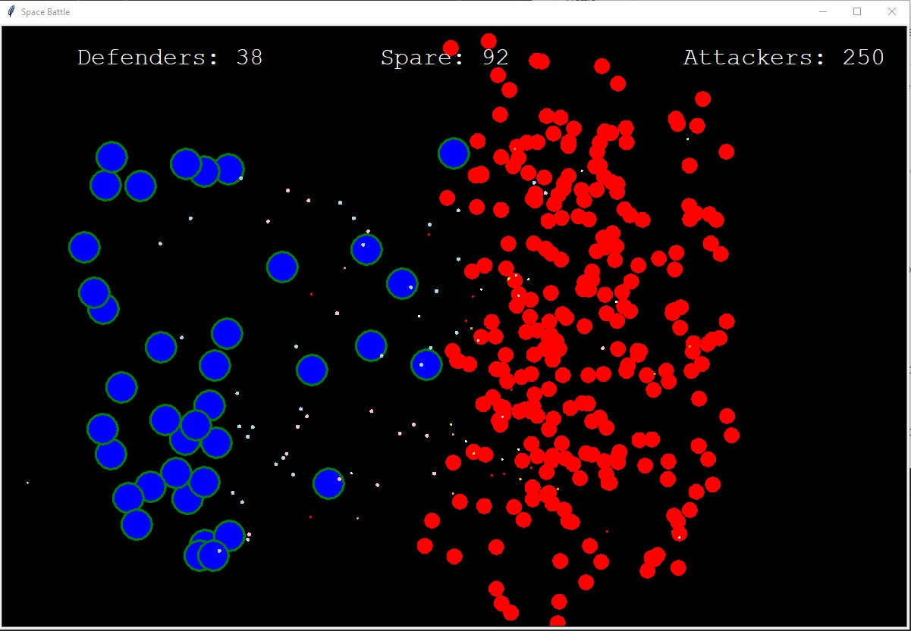

# [Game Arcade](https://github.com/Siddhesh-Agarwal/Game_Arcade)
Game Arcade, consisting of several games, made in python 3

_______________________________________________________________________________________________
## Introduction

This project is a game arcade that contains the following games:
| Game             | Description |
| ---------------  | ----------- |
| Ping-Pong | A 2-player ping pong game that can be played by 2 players from the same PC/Laptop. |
| Snake Game | The classical snake game which needs no intro. |
| Space Battle | A Space battle game which is all about the formations of your spaceships. |
| Tic-Tac-Toe | Also called as Noughts and Crosses, this game is the best timepass for kids even after several decades. |

To run program, execute the [Run_Me.py](https://github.com/Siddhesh-Agarwal/Game_Arcade/blob/main/Run_Me.py) file after downloading the whole program.
On execution, the user will see a menu like the one below:  

  

On selecting the game the user is interested in playing, another window will open. Say the user decides to play snake game, then a menu like this will open:  

  
_______________________________________________________________________________________________
## [Ping Pong](https://github.com/Siddhesh-Agarwal/Game_Arcade/blob/main/Games/Ping_Pong.py)

**AIM:**  
The objective of the game is to score 110 points before the other player.

**SCORING:** 
The score is incremented by 10 for every miss by the opponent.

**LOSING:** 
A player can lose if the opponent player scores 110 points before one does.

**CONTROL:** 
*Player A*: can control his/her using the `w` and `s` keys for up and down respectively.  
*Player B:* can control his/her using the `up key` and `down key` for up and down respectively.
_______________________________________________________________________________________________
## [Snake Game](https://github.com/Siddhesh-Agarwal/Game_Arcade/blob/main/Games/Snake_Game.py)

**AIM:** 
The objective of the game is to collect as many apples as possible and create a maximum score.

**SCORING:** 
* The score is incremented by 10 for every apple eaten.
* The length of snake increases by 1 unit for every apple eaten.

**LOSING:** 
The player can get out in the following ways: 
1) Head-on collision with bush.
2) Head-on collision with own body.

**CONTROL:** 
The snake can be controlled using the arrow keys(`Up key`, `Right key`, `Down key` and `Left key`)
_______________________________________________________________________________________________
## [Space Battle](https://github.com/Siddhesh-Agarwal/Game_Arcade/blob/main/Games/Space_Battle.py)

**AIM:** 
The main objective of the game is to eliminate enemy spaceships while making sure that you do not run out of your spaceships on the battlefield.

**LOSING:** 
You can lose the game if:

1. You run out of spaceships while there are still opponent spaceships on the battlefront.
2. Your spaceships on the battleground are destroyed and the on-field spaceships are 0 (though you may still have spare ships).

**WIN:** 
You win the game if you destroy all the enemy spaceships.

**CONTROL:** 
Left click in the place where you want to deploy your ship in the screen.
_______________________________________________________________________________________________
## [Tic-Tac-Toe](https://github.com/Siddhesh-Agarwal/Game_Arcade/blob/main/Games/Tic_Tac_Toe.py)

**AIM:** 
The goal of the game is for players to position their marks so that they make a continuous line of three cells vertically, horizontally, or diagonally.

**WIN:** 
If one player makes a line of 3 cells vertically, horizontally or diagonally, then that player wins the game.

**DRAW:** 
If none of the players are successful in making a line of 3 cells vertically, horizontally or diagonally even after all the 9 cells have been used up, The game ends in a draw (neither players win/lose).

**HOW TO PLAY:** 
* Players are required to alternate turns and click on the box they would like to fill.
* Once the game is over, the board should be reset to play again.
_______________________________________________________________________________________________
## Contact

**Developed by:** [Siddhesh Agarwal](https://github.com/Siddhesh-Agarwal)  
**E-mail:** siddhesh.agarwal@gmail.com
